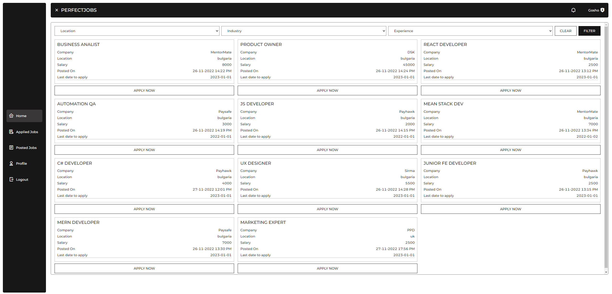
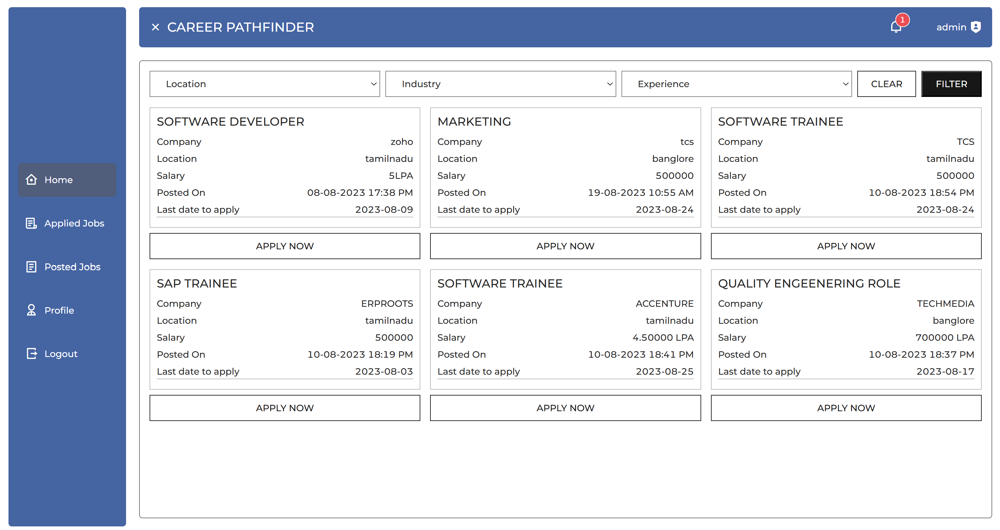
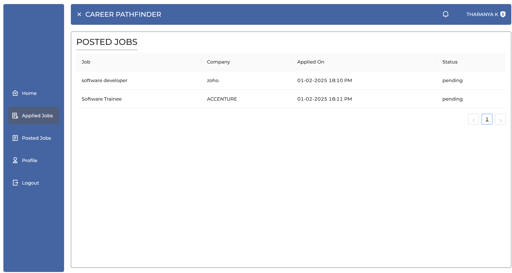
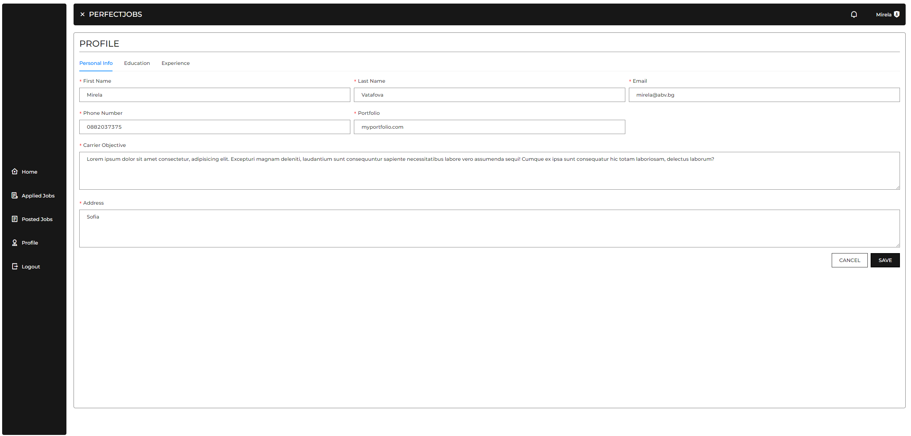
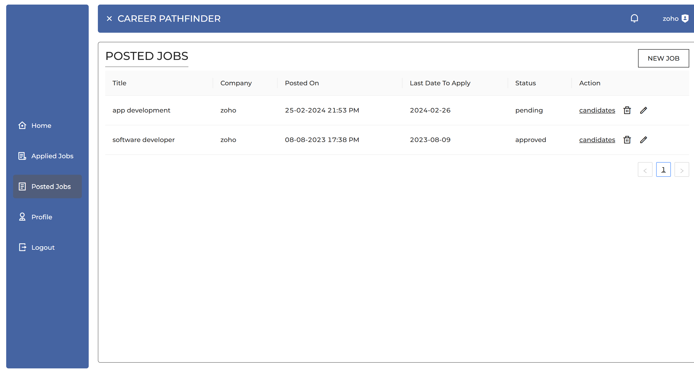
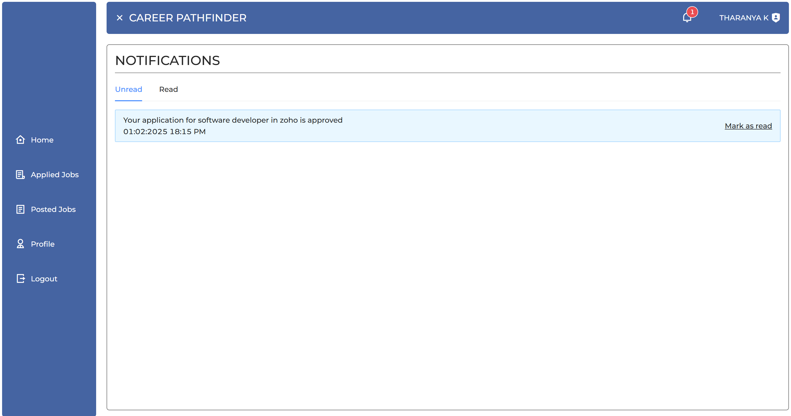
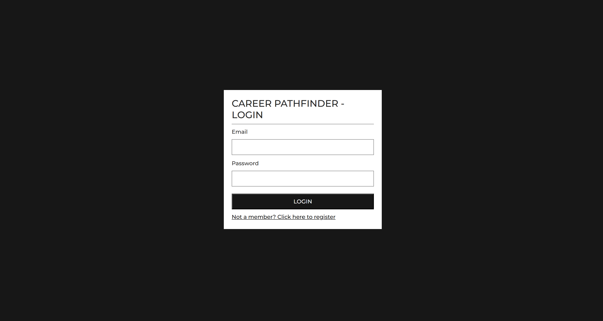

<h1 align="center"><i>CAREER PATHFINDER</i></h1>

**_
CAREER PATHFINDER-lite is a job portl application. The project was built with React and Firebase.
_**

  <a href="https://vercel.com/tharanya-ks-projects/career-pathfinder/">
    
    

    
    

    
    

    
    

    
    

    
    

    
    

  </a>

    

  
  
  
  __Features__
  
   

  - <i><b>Home page</b></i>
  - <i><b>Auth (Register, Login)</b></i>
  - <i><b>Type of users (Admin and Standard user)</b></i>
  - <i><b>Update user profile</b></i>
  - <i><b>Create job post (user only)</b></i>
  - <i><b>Update job post (owner only)</b></i>
  - <i><b>Approve job post (admin)</b></i>
  - <i><b>Apply for job (user different from the post owner))</b></i>
  - <i><b>Approve/Reject job application (post owner))</b></i>
  - <i><b>Notifications when new job post created (admin)</b></i>
  - <i><b>Notifications when job post is approved/rejected (post owner)</b></i>
  - <i><b>Notifications when user applying for job post (post owner)</b></i>
  - <i><b>Notifications when job application is approved/rejcected (applied user)</b></i>

  

<h2>Hosted at <a href="https://perfectjobs-lite.netlify.app/" />https://vercel.com/tharanya-ks-projects/career-pathfinder/</h2>

<h3>Admin credentials</h3>

username: admin@gmail.com

password: admin

